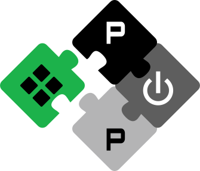

<div align="center">

# Chimera: A flexible microcontroller SoC template
<div>

<a href="https://pulp-platform.org">

</a>

Chimera is an open-source, highly configurable microcontroller System-on-Chip (SoC) template designed specifically for multi-cluster, heterogeneous computing systems. Its primary objective is to offer a modular platform to seamlessly integrate and manage hardware accelerators, providing developers and researchers an intuitive and extensible foundation.\
Chimera is developed as part of the [PULP (Parallel Ultra-Low Power) Platform](https://pulp-platform.org/) project, a joint effort between ETH Zurich and the University of Bologna.

<div aign="center">

[](https://github.com/pulp-platform/chimera/actions/workflows/gitlab-ci.yml?query=branch%3Devel)
[](CHANGELOG.md)
[](LICENSE-APACHE)
[](LICENSE-SHL)
<div>

[Getting started](#-getting-started)
[Simulation](#-simulation)

## License

Unless specified otherwise in the respective file headers, all code checked into this repository is made available under a permissive license. All hardware sources and tool scripts are licensed under the Solderpad Hardware License 0.51 (see LICENSE) or compatible licenses. Register file code (e.g. hw/regs/*.sv) is generated by a fork of lowRISC's regtool and licensed under Apache 2.0. All software sources are licensed under Apache 2.0.

## Getting started

### Pre-requisites
Chimera uses [bender](https://github.com/pulp-platform/bender) to manage its dependencies and to automatically generate compilation scripts. \
Further, you need to have a working riscv GCC compiler in your path. You also need to have a modern version of modelsim in your path. We recommend using GCC-9.2.0 and Questa-2022.3; on IIS systems you may use the pre-installed packaged SEPP versions for this.

If you are working on an IIS system, you can use the preinstalled SEPP packages to add the correct versions of the RISC-V toolchain and questasim into your path. If you use bash, you might run
```
riscv bash
questa-2022.3 bash
```


If you are not on an IIS system, please ensure a RISC-V toolchain and questa installation are available in your path by checking that the outputs of
```
which riscv32-unknown-elf-gcc
which vsim
```
are not empty.


To install the required python packages into your environment and setup dependencies, you can run
``` shell
pip install -r requirements.txt

bender checkout

```
If you have all needed dependencies and you want to build the entire Chimera SoC, both RTL and SW, just run

``` shell
make chim-all
```
If you want to build the system step by step, all the necessary make targets are listed below:

To build Cheshire and Snitch run
``` shell
make chs-hw-init
make snitch-hw-init
```

To regenerate software tests and libraries:

`make chim-sw`

This step must be executed before building the hardware to ensure the correct generation of the bootrom.

To build the host device bootrom:

`make chim-bootrom-init`

To build Chehsire simulation files for ModelSim:

`make chs-sim-all`

To build Chimera simulation files for ModelSim:

`make chim-sim`


## Making Register modifications


To regenerate SoC Regs:

`make regenerate_soc_regs`

## Making Bootrom modifications

To rebuild the snitch bootrom:

`make snitch_bootrom`

## Simulation

```
cd target/sim/vsim
vsim
source setup.chimera_soc.tcl
source compile.tcl
source start.chimera_soc.tcl
```

By default the signals are not loaded into QuestaSim.
To load all the signals `set DEBUG 1` before running `start.chimera_soc.tcl`.

## CXX Formatting

To format all files within the `sw` directory, run
```
python scripts/run_clang_format.py -ir sw/
```

Our CI uses llvm-12 for clang-format, so on IIS machines you may run
```
python scripts/run_clang_format.py -ir sw/ --clang-format-executable=/usr/pack/riscv-1.0-kgf/pulp-llvm-0.12.0/bin/clang-format

python scripts/run_clang_format.py -ir hw/ --clang-format-executable=/usr/pack/riscv-1.0-kgf/pulp-llvm-0.12.0/bin/clang-format
```

otherwise you should specify a valid clang-format-12 binary instead.

## Verilog Formatting

To format all hardware source files, run

```
verible-verilog-format --flagfile .verilog_format --inplace --verbose hw/*.sv target/sim/src/*.sv
```
